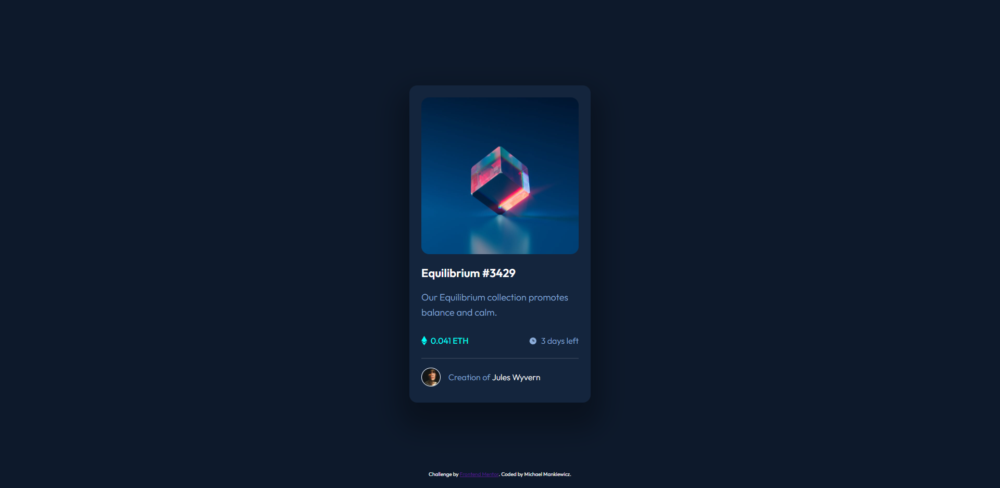

# Frontend Mentor - NFT preview card component solution

This is a solution to the [NFT preview card component challenge on Frontend Mentor](https://www.frontendmentor.io/challenges/nft-preview-card-component-SbdUL_w0U). Frontend Mentor challenges help you improve your coding skills by building realistic projects. 

## Table of contents

- [Overview](#overview)
  - [The challenge](#the-challenge)
  - [Screenshot](#screenshot)
  - [Links](#links)
- [My process](#my-process)
  - [Built with](#built-with)
  - [What I learned](#what-i-learned)
  - [Continued development](#continued-development)
  - [Useful resources](#useful-resources)
- [Author](#author)
- [Acknowledgments](#acknowledgments)

## Overview

### The challenge

Users should be able to:

- View the optimal layout depending on their device's screen size
- See hover states for interactive elements

### Screenshot



### Links

[My Website](https://first-css-project.netlify.app/)

## My process

### Built with

- Semantic HTML5 markup
- CSS custom properties
- CSS Flexbox
- CSS Grid

### What I learned

This was my first project using CSS. I learned about the differences between Flexbox and Grid and what times are best to use each of them. 

For instance, I mostly used Flexbox in this project since I had a lot of content that needed to be placed adjacent to each other, such as the ETH icon and value, the clock and days left. Flexbox is great when you can use it right out of the box as long as you create the right html like so:

```html
<div class = "data">
        <div class = "left">
          
          <p>
            0.041 ETH
          </p> 
        </div>
        <div class = "right">
          
          <p>
            3 days left
          </p>
        </div>
      </div>
```

```css
.data *{
    display: flex;
}
```

I learned how to justify content and align items. I learned about different positioning modes and in particular how to use position: absolute to overlap items. In this project, I had to show an eye icon when the cursor overlaps the photo of the NFT. I thought I can accomplish this by creating an invisible div of the eye, and make it visible when it is hovered. The difficult part was that the eye icon is a different size than the NFT photo. So, I solved this by wrapping the eye in a div and centering it, and wrapping the NFT and the div in another div, and then scaling each element to expand to the size of the wrapper. The widths were the same, but I had to tweak the bottom position of the eye div to match that of the NFT photo.

```html
<div class = "photo">
        
        <div class = "overlay">
          
        </div>
      </div>
```
```css
.photo *{
    width: 100%;
    border-radius: 15px;
}
.photo{
    position: relative;
}
.overlay{
    display: flex;
    bottom: 2px;
    position: absolute;
    justify-content: center;
    align-items: center;
    width: 100%;
    height: 100%;
    opacity: 0;
}
.overlay:hover{
    opacity: 100%;
    background-color: rgba(0,255,247,0.5);
    cursor: pointer;
}
```

I also learned about different units other than pixels in effort to make my website as responsive and accomdating as possible. Here, I set the width of the whole card to be in ch units, which means the card will expand to accomodate a user's font-size settings.

```css
.card{
    width: 53ch;
    background-color: var(--clr-neutral-card);
    border-radius: 15px;
    box-shadow: 0px 30px 50px 20px rgba(0, 0, 0, 0.3);
}
```

### Continued development

I am mostly comfortable using CSS after this project, however I want to learn how to properly scale elements according to screen size. Currently, if the window size is too short vertically, the card is cut off, and I am not sure what to do. I believe I need to learn how to use min() in css and learn more about units and when to use different units.

Also, my project does not include JavaScript because I was only focused on practicing CSS and HTML, but now that I have some practice I will start to learn JavaScript and then make a simple project with it.

### Useful resources

- [CSS Youtube Channel](https://www.youtube.com/kepowob) - This man is a CSS wizard and helped me learn dozens of CSS details and good coding practice after I learned the basics elsewhere.
